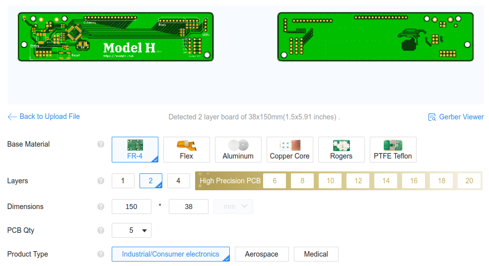
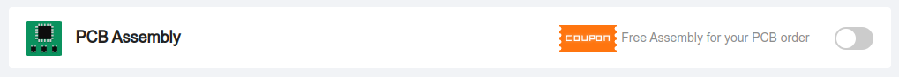
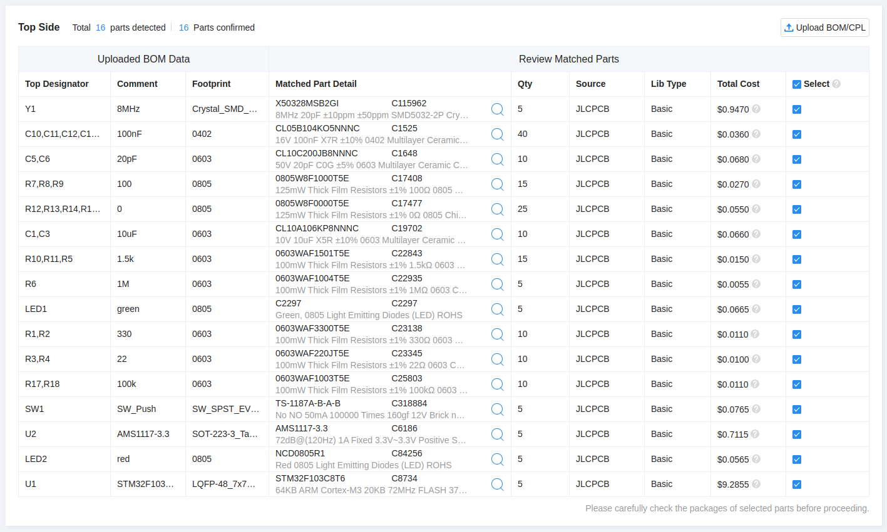
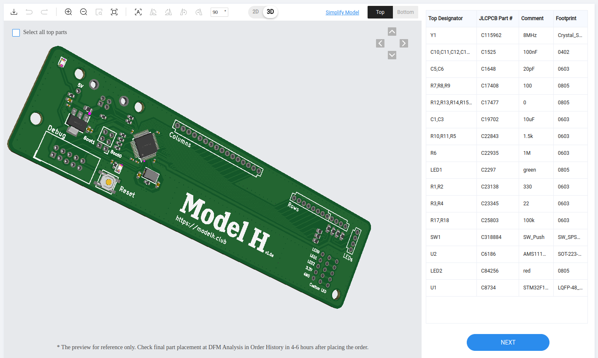
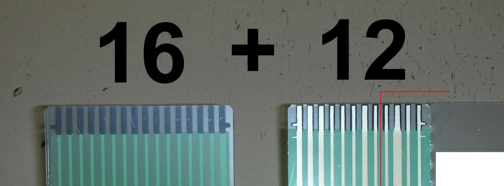
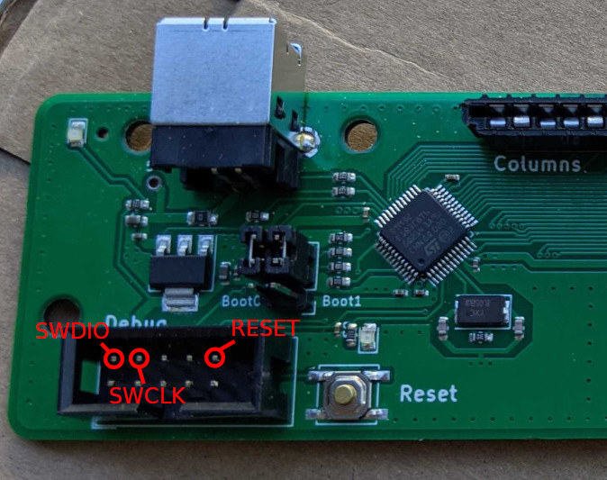

# Model H
## Replacement controller board for IBM Model M Keyboard


The [IBM Enhanced Keyboard (Model
M)](https://en.wikipedia.org/wiki/Model_M_keyboard) is widely
considered the best keyboard for its typing experience. First produced
in 1985, it was made of high quality materials and is very
durable. IBM produced over 10 millions units, and because of their
durability, there are still many working keyboards today.


However, those keyboards were designed for the [PS/2
port](https://en.wikipedia.org/wiki/PS/2_port), which is rarely seen
in recent computers. Some units that were shipped with terminals even
used a RJ-45 interface. As a result, it can be difficult to use this
keyboard with modern computers.

If you want to enjoy the great typing experience of an IBM Model M on a modern computer, you have basically 3 options:

1. You can buy a new unit with a USB interface at [Unicomp](https://www.pckeyboard.com/page/product/NEW_M).
2. You can use an active [PS/2 to USB converter](https://www.clickykeyboards.com/product/ps-2-to-usb-adapter-converter-for-keyboards/). That solution will not work for RJ-45 Model Ms, though.
3. You can replace the original controller with a new one supporting USB. That is what this project is about.

Out of those 3 options, creating your own controller is clearly the
most involved. That being said, the result is very neat. You'll end up
with a native USB connector that is very well integrated with the
keyboard.


In addition, the controller firmware uses
[QMK](https://github.com/qmk/qmk_firmware), which allows you to
remap your keys. This is very handy to add media keys and other custom
combinations you may need.

To make your own board, you don't need any knowledge in electronics, however, you'll have to do a bit of soldering.

This repo contains an open-source PCB design for a replacement
controller board for the IBM Model M keyboard. It was designed by
[John Hawthorn](https://github.com/jhawthorn). The controller is a
drop-in replacement for the original controller, which includes USB
support and modern QMK-based firmware. It can be installed without any
modification to the keyboard and can be fully reverted.

## Related work

This work is not the first attempt at a replacement controller for the Model M. Here are a few related projects:

- https://www.schwingen.org/modelm-usb/
- https://github.com/ashpil/Model-M-Type-C
- https://github.com/sje-mse/yacobo
- https://www.store.level1techs.com/products/p/mstar-classic-model-m-controller-conversion-kit-rkfc5-d7a89

## Production tutorial

In this tutorial, we will go into all the steps needed to make your own
Model H controller board. Note that I assume you'll be using Linux
(specifically Ubuntu). You can probably accomplish it under Windows if
you install the
[WSL](https://learn.microsoft.com/en-us/windows/wsl/install). However,
I have not tested it.

### PCB
Here, we show how to produce the PCB with
[JLCPCB](jlcpcb.com). There are many similar providers. Feel free to
choose a different one. Note that the bill of material has been
optimized for parts available at JLCPCB. Should you choose a different
provider, you might have to replace some parts.

1. Go to [JLCPCB](jlcpcb.com) and create an account.
2. On the JLCPCB home page, use the button `Add gerber file` to upload the file `gerber.zip` found in the `production` folder of this repo. You should see a page like the image below. Leave the default options.



3. At the bottom of the page, select `PCB Assembly`. Leave the default options, but you may want to change the `PCBA Qty` to 2. Also, select `Yes` for `Confirm Parts Placement`.



4. On the right of the page, click on `NEXT`.
5. You can now visualize both sides of your PCB. Then click on `NEXT` and upload the two files `bom.csv` and `positions.csv` from the `production` folder.
6. Click on `Process BOM & CPL`. At this point, you should see a list of all the components for your design. If all of them are available, click `NEXT`. If a part is out of stock, click on the magnifying glass to select a replacement. Alternatively, you can wait until the part is in stock again. All components of the design were chosen among JLCPCB's __basic parts__ and should normally be available.
> [!NOTE]
> It was reported that the STM32F micro-controller has been moved from __Basic Parts__ to __Preferred Extended Parts__. It will still work as expected, but might become a bit more expensive.



7. This page should show you the parts placement (as shown below). Select the 3D view and verify that the components are placed properly. Then click `NEXT`.



8. Select Product Description: Office Appliance.../Keyboard...

9. Save to Cart, Check Out.

#### Cost
At the time of writing (May 2023), the cost of 5 PCBs with 2 assembled was $21 (without shipping).

---

### 3D Printed connector spacer
To maintain the USB connector and the controller board in place, you will have to 3D print a small connector spacer to be inserted around the USB connector.
The file to be printed is located at `shim/shim.stl`.
You can use any 3D printing service for this, however it might be a good idea to use JLCPCB and group the order with the PCB one.

---

### Additional Components

While you wait for your PCB to be fabricated, you can order the few
additional components that you'll need to hand solder onto the
board. But first, you need to disassemble your keyboard and check what
kind of wiring you have. Look at this [tutorial](https://blog.nathanv.me/posts/ibm-model-m-cleaning/) for this.

There are several types of connectors for the LEDs.

1. If you don't have LEDs, that's easy. You'll just need a 16-position and a 8-position FFC connectors.
2. If you have an old keyboard with the type of LED cable shown below, you'll have to figure out the type of connector you'll need for it. In addition, you'll need a 16-position and 8-position FFC connectors.


3. If your LEDs are connected with a FFC cable like the one shown below, you'll need a 16-position, 8-position and 4-position FFC connectors.


4. Finally, if you LEDs are integrated to the membrane rows connector (see below), you'll need a 16-position and a 12-position FFC connectors.


Below is the list of components you will need to order:

| Part                      | Link                                                                                           | Quantity |
|---------------------------|------------------------------------------------------------------------------------------------|----------|
| 16-POS FFC TE connector   | https://www.digikey.com/en/products/detail/te-connectivity-amp-connectors/6-520315-6/688643    | 1        |
| 8-POS FFC TE connector    | https://www.digikey.com/en/products/detail/te-connectivity-amp-connectors/5-520315-8/688639    | 0/1      |
| 4-POS FFC TE connector    | https://www.digikey.com/en/products/detail/te-connectivity-amp-connectors/5-520315-4/2262309   | 0/1      |
| 12-POS FFC TE connector   | https://www.digikey.com/en/products/detail/te-connectivity-amp-connectors/6-520315-2/1137020   | 0/1      |
| USB-B connector           | https://www.digikey.com/en/products/detail/te-connectivity-amp-connectors/292304-1/773785      | 1        |
| Debug port connector      | https://www.digikey.com/en/products/detail/on-shore-technology-inc/302-S101/2178422            | 1        |
| 6-POS header connector    | https://www.digikey.com/en/products/detail/w%C3%BCrth-elektronik/61300621121/4846835           | 1        |
| jumper                    | https://www.digikey.com/en/products/detail/w%C3%BCrth-elektronik/60900213421/2508447           | 2        |
| USB A-B cable             | https://www.digikey.com/en/products/detail/tripp-lite/U022-006-BE/7104962                      | 1        |

#### Cost
Less than $10.

---

### Soldering

Once you received the controller board and all the components, it's
time to solder them to the board. If you use the right technique,
soldering is not that hard. This
[tutorial](https://learn.sparkfun.com/tutorials/how-to-solder-through-hole-soldering/all)
goes in a lot of details and the video explains very well how to
easily solder your through-hole components into the board. If you've
never soldered before, I would recommend practicing on a different
board before assembling your Model H.

You can clearly see where to place the components on the board picture
at the top of this page. Pay attention to the FFC connectors
direction. Note the white lines on the board indicating the right
connectors direction.

Place the two jumpers (`boot0` and `boot1`) in `0` position (as shown on the board picture above).

---

### Bootloader

At this point, you should have a complete controller. However, do not
insert it into your keyboard just yet. You still need to program your
controller and it is much easier to do it when not attached to the
keyboard.

The STM32F103 micro-controller from the board does not ship with a USB
bootloader. This means that you cannot use the USB port just yet. If
you plug the controller to your computer, you should see the
right-most LED light up, but the computer will not recognize the
controller.

Since we cannot use the USB port to communicate with the controller,
we will have to rely on the `debug` port. To connect it to your
computer, you will need to use a ST-Link device, such as the one shown
below. Those devices can be found on [Amazon](https://www.amazon.com/dp/B07SQV6VLZ?psc=1&ref=ppx_yo2ov_dt_b_product_details) for ~$10.


1. Download the latest [stlink](https://github.com/stlink-org/stlink) from [here](https://github.com/stlink-org/stlink/releases/tag/v1.7.0) and install it.
```bash
sudo dpkg -i stlink_1.7.0-1_adm64.deb
```
> [!TIP]
> If you do not want to go through the following steps for compiling your own bootloader and firmware, you can directly jump to the [section below](#pre-compiled-firmware-and-bootloader) to download my pre-compiled versions.

2. Install the ARM compiler
```bash
sudo apt-get install gcc-arm-none-eabi cmake build-essential
```
3. Clone the [stm32f103-keyboard-bootloader](https://github.com/jberclaz/stm32f103-keyboard-bootloader) locally. This repo contains the bootloader you'll need for your keyboard.
```bash
git clone git@github.com:jberclaz/stm32f103-keyboard-bootloader.git
cd stm32f103-keyboard-bootloader
git checkout modelh
```
4. Build the bootloader
```bash
mkdir build && cd build
cmake ..
make -j $(nproc)
```
This should produce a file called `bootloader-modelh.bin` in the `build` folder.

> [!NOTE]
> If you have trouble building the booloader, it may be
> because your distribution is too new. I created a script that allows
> you to build inside a Ubuntu 20.04 Docker. To do that, just call the
> script
> ```bash
> ./build_inside_docker.sh
> ```
> This should produce the same artifact `bootloader-modelh.bin`.

5. Connect your Model H with the ST-Link device. Connect only the 3 pins `SWDIO`, `SWCLK` and `RESET` to the debug port of the controller, as shown on the picture below. Do not connect the other pins.


6. Power on your controller by plugin the USB cable

7. You can now flash your controller:
```bash
sudo st-flash write build/bootloader-modelh.bin 0x8000000
```

8. After the flashing is complete, you should see a `DFU` device when listing the USB devices with `lsusb`. You can now disconnect the ST-Link from your controller.

---

### QMK Firmware

The final step in this tutorial is programming your controller with
the QMK firmware. This is the firmware that will monitor the key
pressed on your keyboard and communicate with the PC. Now that the
bootloader is installed, flashing the firmware can be simply done
through the USB port.

1. Clone the QMK firmware
```bash
git clone https://github.com/qmk/qmk_firmware.git
cd qmk_firmware
```

2. Install DFU-Util
```bash
sudo apt-get install dfu-util
```

3. Install the qmk binary
```bash
virtualenv -p python3 venv
. venv/bin/activate
pip3 install qmk
```

4. Build the firmware. This step should produce a firmware binary `ibm_model_m_modelh_default.bin`.
```bash
make ibm/model_m/modelh:default
```

5. Flash the firmware onto your controller. At that point, your controller should be connected via the USB cable and visible as `DFU` device.
```bash
make ibm/model_m/modelh:default:flash
```

It is possible that this flashing method won't work due to your system configuration. If that's the case, here is an alternate method for flashing the firmware. It needs root access.
```bash
sudo su
dfu-util -D ibm_model_m_modelh_default.bin
```

6. If the firmware flashing operation is successful, you should now see your keyboard listed among your USB devices:
```
$ lsusb
...
Bus 001 Device 088: ID feed:b155 IBM Model M
...
```

7. If for any reason you need to flash the firmware again, press the push button on the board to put it back to `DFU` mode.

#### Alternate firmare: QMK-Vial

[QMK-Vial](https://get.vial.today/) is an alternate firmware
option. It is functionally very similar to QMK, as it was forked from
this project. The main benefit of QMK-Vial is that it allows to
reconfigure the key maps via a convenient [web
UI](https://vial.rocks/) without having to re-flash the firmware.

To use QMK-Vial instead of QMK, follow the QMK steps above, with the following changes:
- Clone the project with `git clone https://github.com/vial-kb/vial-qmk`. No need to checkout a specific branch.
- Compile the firmware with `make ibm/modelh:vial`
- Flash the firmware with `dfu-util -D ibm_modelh_vial.bin`

#### Pre-compiled firmware and bootloader

If you don't want to go through all the above steps of compiling your own firmware from scratch, here are versions of QMK and QMK-Vial that I compiled myself:
- [Bootloader](firmware/bootloader-modelh.bin)
- [QMK](firmware/modelh_default.bin)
- [QMK-Vial](firmware/ibm_modelh_vial.bin)

---

### Re-assembly
At this point, if everything went well, you can disconnect your Model
H controller and insert it into your Model M keyboard. Make sure to
handle the FFC cables very carefully when you disconnect the original
controller and connect the Model H.

Make sure to insert the 3D printed spacer on top of the connector as shown below. This will hold the connector and the board into place.


After this, you can close the keyboard frame and replace the 4 screws. Your keyboard is now ready to be used!

---

### Upgrading the firmware

One of the nice features of the QMK firmware is that it allows you to change the keys layout. Please look at the [QMK documentation](https://docs.qmk.fm/#/) to learn how to do that.

If you've created a new key layout and you want to flash your controller firmware once your keyboard is assembled, you don't need to open your keyboard again. The bootloader has a nice feature that allows you to put the controller in DFU mode, without having to access the controler.

1. Disconnect your USB cable.

2. While holding down the `Esc` key, plug in the USB cable again.

3. Your keyboard should now appear as a `DFU` device. It is ready to be flashed again.
